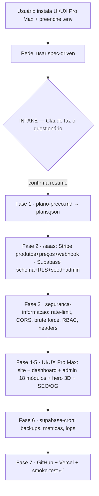

# Claude Code — SaaS Spec-Driven Toolkit

Conjunto de **skills do Claude Code** para transformar qualquer projeto em um **SaaS completo, funcional e seguro** — usando *spec-driven development*: especificar antes de implementar.

> Testado live (e2e) em vários SaaS reais: billing com Stripe (checkout + webhook que ativa o plano), Supabase (schema + RLS + triggers + seed), painel admin, segurança e cron jobs.

## Skills incluídas

| Skill | O que faz |
|---|---|
| **`skills/plano-preco`** | Gera `plano-preco.md` por spec-driven: analisa o projeto + mercado e define N planos (mensal + anual com 2 meses grátis), funcionalidades e limites por plano. Sem limite por GB. |
| **`skills/saas`** | Bootstrap de billing: cria produtos/preços/**webhook** no Stripe e aplica schema (`plans`, `subscriptions`, `payment_events`, `cancellation_feedback`) + RLS + seed no Supabase. Endpoints serverless prontos (checkout/webhook/portal/subscription). |
| **`skills/seguranca-informacao`** | Camadas de cyber-sec: rate limiting, anti brute-force, CORS, headers/CSP, cadastro seguro (e-mail real, anti múltiplas contas por IP, força de senha), CAPTCHA, sessões/refresh, RBAC, validação de webhook + `checklist.md` (OWASP/NIST/LGPD). |
| **`skills/supabase-cron`** | Agenda rotinas via `pg_cron` (backups, métricas, limpeza de logs, saúde) usando url/anon/service_role/token. |

## Orquestração

`spec-driven-development.md` é o **documento mestre**: o passo a passo (Fase 0 → 7) que o Claude Code segue para transformar um projeto em SaaS, combinando as 4 skills, o site institucional + SEO, o painel admin (18 módulos) e o deploy contínuo (GitHub + Vercel).

## O usuário fornece

- **Supabase:** `url`, `anon key`, `service_role key`, `token` (PAT `sbp_…`).
- **Stripe:** `secret/restricted key`.
- **Planos:** quantos e quais. **Admin:** e-mail/senha. **siteUrl** (Vercel).

## Fluxo (do pedido ao deploy)

Documentos: **[GUIA-PASSO-A-PASSO.md](GUIA-PASSO-A-PASSO.md)** (4 cenários) · **[INTAKE.md](INTAKE.md)** (questionário) · **[EXEMPLO-INTAKE.md](EXEMPLO-INTAKE.md)** (caso preenchido) · **[spec-driven-development.md](spec-driven-development.md)** (Fases 0→7).

## Como instalar como skills do Claude Code

Copie as pastas de `skills/` para `~/.claude/skills/` (global) ou `.claude/skills/` (por projeto). Cada skill tem seu `SKILL.md`. Para credenciais, copie **`skills/saas/.env.example` → `.env`** e preencha (as skills leem do `.env` automaticamente) — **gitignored**, nunca commite chaves.

## Segurança

- Nenhuma chave/segredo neste repositório (`config.json`, `plans.generated.json`, `.env` ficam fora).
- `service_role` e chaves Stripe vivem só no backend/host.
- Use **restricted keys** da Stripe sempre que possível e **rotacione** se expostas.

---

Mantido por [@estevam5s](https://github.com/estevam5s). Gerado com Claude Code.
